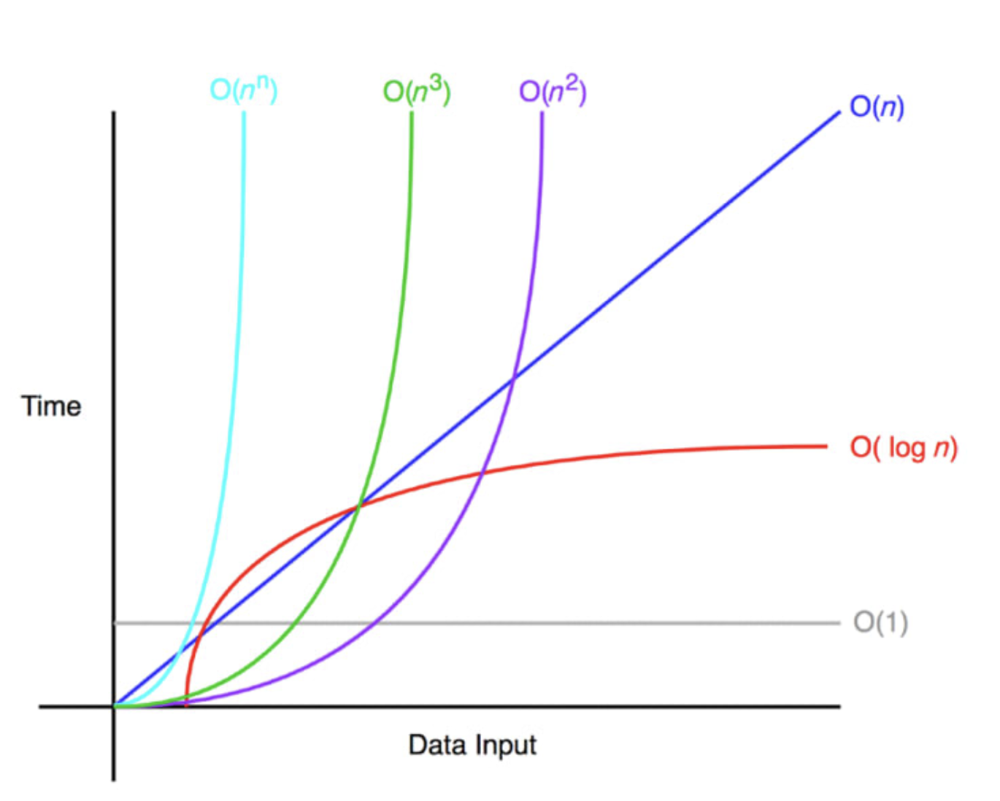

# 빅오 표기법

빅오란 알고리즘이 얼마나 효과적인지 분석하여, 시간 및 알고리즘 공간 복잡도 분석을 위한 표기법이다.

빅오 표기법은 알고리즘의 최악의 경우 복잡도를 측정한다. 여기서 n은 입력의 개수를 나타낸다.



## O(1)

입력 공간에 대해 변하지 않으며, 따라서 O(1)은 상수 시간이라고 한다.
일반적으로 배열에 있는 항목의 인덱스를 사용해 접근하는 경우가 O(1) 알고리즘이다.

```js
function exampleLinear(n) {
  const numList = [1, 2, 3, 4 ...];
  const num = numList[3];
}
```

## O(N)

```js
function exampleLinear(n) {
  for (var i = 0; i < n; i++) {
    console.log(i);
  }
}
```

## O(n2)

```js
function exampleQuadratic(n) {
  for (var i = 0; i < n; i++) {
    console.log(i);
    for (var j = i; j < n; j++) {
      console.log(j);
    }
  }
}
```

## O(N3)

```js
function exampleCubic(n) {
  for (var i = 0; i < n; i++) {
    console.log(i);
    for (var j = i; j < n; j++) {
      console.log(j);
      for (var k = j; k < n; k++) {
        console.log(k);
      }
    }
  }
}
```

## 로그 시간 복잡도

```js
function exampleLogarithmic(n) {
  for (var i = 1; i < n; i = i * 2) {
    console.log(i);
  }
}
```
