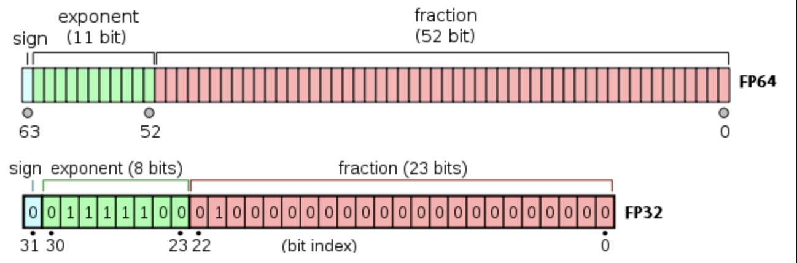

# 자바스크립트 숫자

- 자바스크립트는 숫자에 대해 64비트 부동소수점 표현을 사용한다.
- 부호 비트(63번째)가 1이면 해당 숫자는 음수다.
- 다음 열한 개의 비트(62번째 부터 52번째 비트)는 지수 값 e를 나타낸다.
- 나머지 52비트가 분수 값을 나타낸다.



## 십진분수로 인해 자바스크립트에서 부동소수점 체계가 반올림 오류를 일으킬 가능성

```js
const result = 0.1 + 0.2;
console.log(result === 0.3); // false
```

위와 같은 문제를 해결하는데 도움이되는 Number객체가 자바스크립에 존재한다.

## 자바스크립트 숫자 객체

JS는 모든 숫자를 나타낼 때 부동소수점을 사용하기 때문에 정수 나눗셈이 소용없다.

```js
console.lgo(5 / 4); // 1.25
```

JS에서 정수 나눗셈을 하길 원한다면 다음 중 하나를 사용하면 된다.

### Math.floor

가장 가까운 정수로 내림

```js
Math.floor(0.9); // 0
Math.floor(1.1); // 1
```

### Math.round

가장 가까운 정수로 반올림

```js
Math.round(0.49); // 0
Math.round(0.5); // 1
Math.round(2.9); // 3
Math.round(2.5); // 3
Math.round(1.5); // 2
Math.round(0.5); // 1
Math.round(3.5); // 4
```

### Math.ceil

가장 가까운 정수로 올림

```js
Math.ceil(0.1); // 1
Math.ceil(0.9); // 1
Math.ceil(21); // 21
Math.ceil(21.01); // 22
```

### Number.EPSILON

두 개의 표현 가능한 숫자 사이의 가장 작은 간격을 반환한다. 이는 부동소수점 근사치를 활용해 분수가 제대로
표현되지 않는 문제를 해결하는데 유용하다.

```js
function numberEqual(x: number, y: number) {
  return Math.abs(x - y) < Number.EPSILON;
}

const result = numberEqual(0.1 + 0.2, 0.3);
console.log(result);
```

## 소수 판별기

### 자바스크립트에서 n이 소수인지 알아보는 방법

숫자 n을 2부터 n-1까지의 수로 나눠 나머지가 0인지 확인한다.
아래 코드의 시간 복잡도는 O(n) 이다.
0부터 n까지 모든 수를 확인하기 때문이다.

```js
function isPrime(n: number) {
  if (n <= 1) {
    return false;
  }

  // 2부터 n-1까지의 수로 나눈다.
  for (let i = 2; i < n; i += 1) {
    if (n % i === 0) {
      return 0;
    }
  }

  return true;
}
```

#### 위의 코드를 개선해보자

먼서 소수는 다음과 같은 숫자로 나열된다.

```plain
2,3,5,7,11,13,17,19,23,29,31,37,41,43,47,53...
```

- 0과 1은 소수가 아니다.
- 2와 3은 소수이다.
- 2또는 3의 배수는 제외한다.
- 2와 3을 제외한 모든 소수는 6K ± 1 의 규칙을 갖는다.
- 반복문을 n의 제곱근까지만 확인한다.

```js
function isPrime(n: number) {
  if (n <= 1) return false; // 0 and 1 are not prime numbers
  if (n <= 3) return true; // 2 and 3 are prime numbers

  // Check if n is divisible by 2 or 3
  if (n % 2 === 0 || n % 3 === 0) return false;

  // Check divisibility by numbers of the form 6k ± 1 up to √n
  for (let i = 5; i * i <= n; i += 6) {
    if (n % i === 0 || n % (i + 2) === 0) {
      return false;
    }
  }

  return true;
}
```

위 코드의 시간 복잡도는 O(sqrt(n)) 이다.

## 소인수분해

```js
function primeFactors(n: number) {
  // Print the number of 2s that divide n
  while (n % 2 == 0) {
    console.log(2);
    n = n / 2;
  }

  // n must be odd at this point. So we can skip one element (Note i = i +2)
  for (var i = 3; i * i <= n; i = i + 2) {
    // While i divides n, print i and divide n
    while (n % i == 0) {
      console.log(i);
      n = n / i;
    }
  }
  // This condition is to handle the case when n is a prime number
  // greater than 2
  if (n > 2) {
    console.log(n);
  }
}
primeFactors(10); // prints '5' and '2'
```

## 무작위 수 생성

```js
Math.random() * 100; // floats between 0 and 100
Math.random() * 25 + 5; // floats between 5 and 30
Math.random() * 10 - 100; // floats between -100 and -90

Math.floor(Math.random()) * 100; // integer between 0 and 99
Math.round(Math.random()) * 25 + 5; // integer between 5 and 30
Math.ceil(Math.random()) * 10 - 100; // integer between -100 and -90
```
