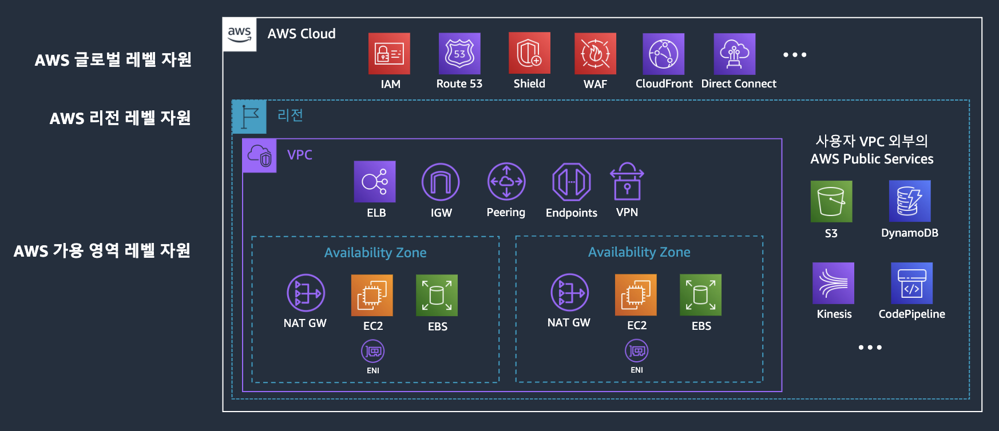
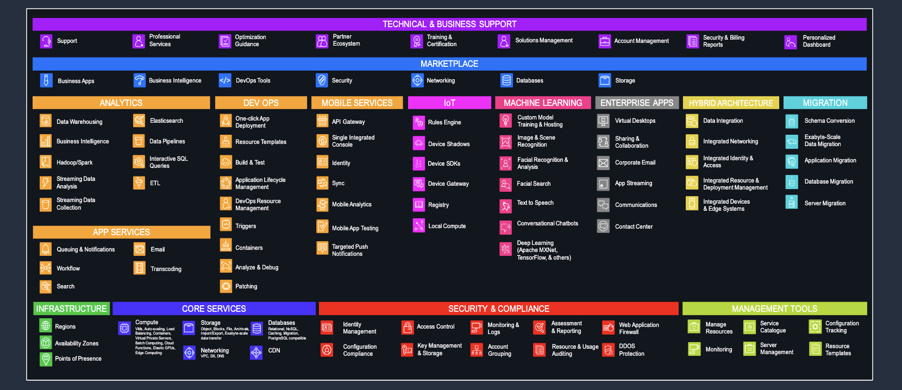

# Intro

## AWS 글로벌 인프라

- 31개의 리전, 99개의 가용 영역, 410+개의 Pops(Points of Presence)
- 2016년부터 서울 리전 운영(가용 영역 4개)
- 사용할 서비스가 각 리전에서 지원하고 있는지 확인해야함(리전마다 지원하는 서비스가 다름)
- 리전마다 서비스의 비용이 상이함

## Region(리전)

- AWS가 전세계에서 데이터센터를 클러스터링하는 물리적 위치. 즉, AWS의 서비스 운영 지역.
- 지리적 영역내에서 격리되고, 물리적으로 분리된 복수개(최소 3개)의 AZ로 구성된다.

## AZ(Availability Zone, 가용영역)

- 가용영역이란 복수의(1개 이상)의 데이터 센터로 구성된 물리적으로 완벽히 분리된 독립적 인프라
- 독립적으로 냉각되고, 물리적 보안을 갖추고 있음
- 지연시간이 매우 짧은 중복 네트워크를 통해 2중화로 구성되어있음
- 정전, 낙뢰 등의 재해상황으로부터 안전하게 보호하기 위해, 가용영역 간에는 충분한 물리적 거리
- 기본적으로 고가용성 중시
- 하나의 가용영역에서 문제가 발생했을 때 다른 가용영역에서 서비스 할 수 있도록, 복수개의 가용영역에서
  서비스 할 것을 권장함

## Points of Presence(Pops, 상호접속위치)

- 둘 이상의 네트워크나 통신장치가 서로 연결되는 지점
- Edge Location 과 Regional Edge Cache 로 구성됨
- CDN 및 Edge 서비스 캐시 서버

## AWS 자원 레벨

- AWS 서비스는 레벨별로 구분
- 이용하려는 서비스가 어떤 레벨의 서비스인지 알고 있다면, 아키텍쳐를 수립하는데 도움이 됨

### VPC(Virtual Private Cloud)

- 리전 레벨의 자원
- 사용자가 정의하는 가상의 프라이빗 네트워크 환경
- 하나의 VPC가 여러 리전에 배포될 수 없음

## AWS 서비스

