# Webserver 생성

## Webserver 생성(EC2, ELB, Monitoring, Auto Scaling, Static Website Hosting)

EC2, AMI, ELB, Monitoring, Auto Scaling, Static Website Hosting 을 실습해본다.

## EC2 생성

### EC2 콘솔에 들어와서 Launch Instance 버튼 클릭

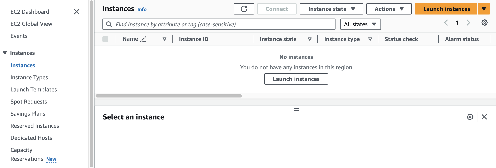

### EC2 instance name 을 webserver 1로 설정

추후 AMI를 만들어 webserver 2를 생성하고 public subnet C 에 연결할 것

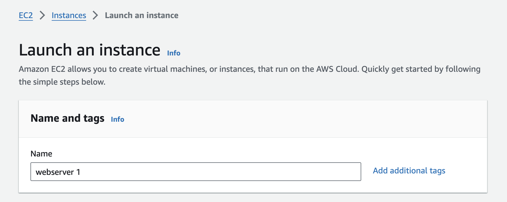

### Quick Start 에서 OS 선택 및 각종 옵션 설정

아래의 이미지는 빠른 데모를 위해 설정한 것이며, 나중에는 각 사용에 맞게 다른 OS 및 옵션을
선택하는 것이 좋다. 보통 ubuntu를 선택했었는데 최근에 macOS까지 고를 수 있는 것이 새롭다.

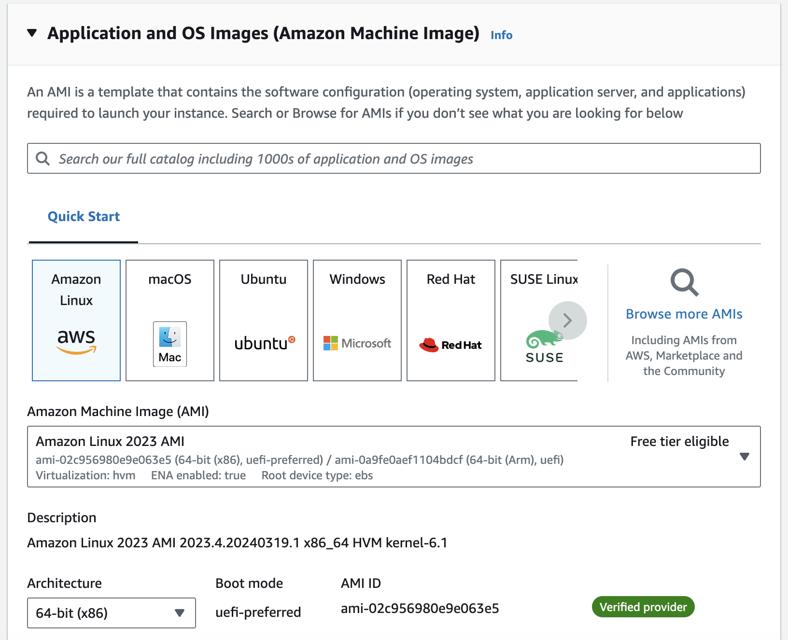

비용을 위해 Freetier 를 선택한다.
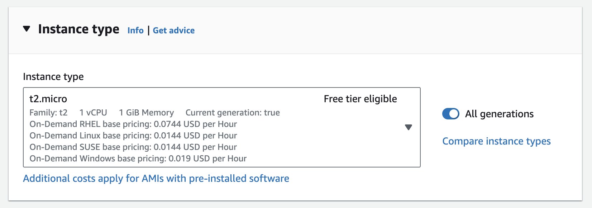

키페어를 생성하고 연결한다.
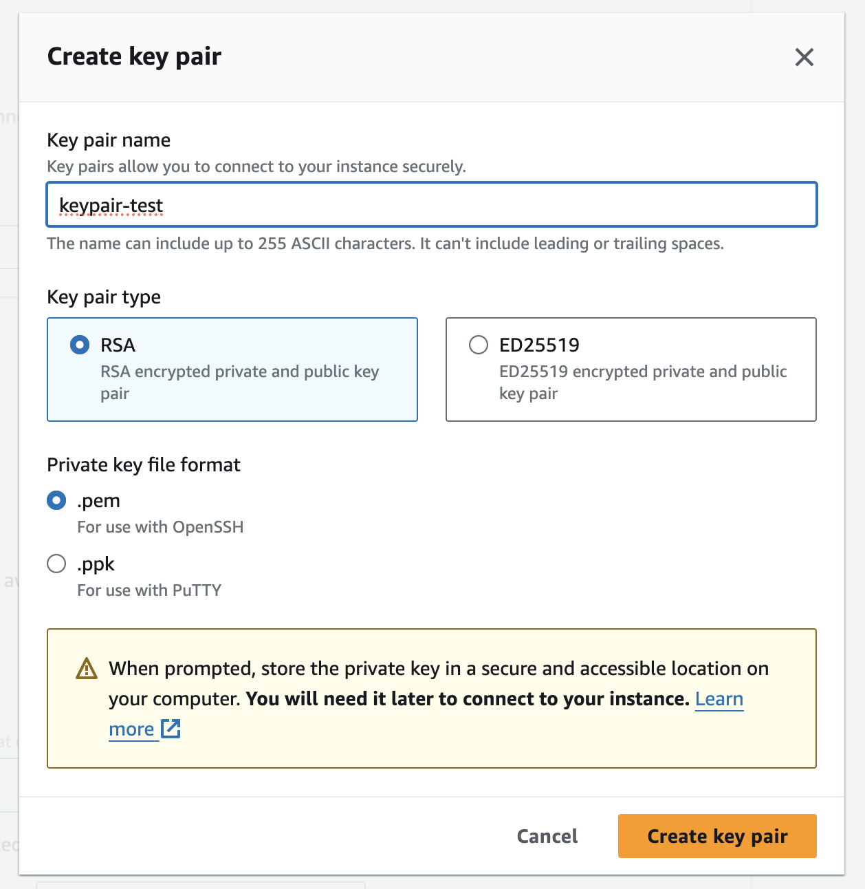
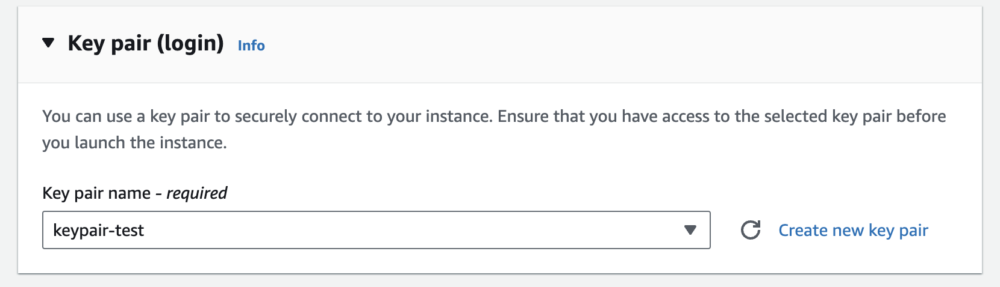

Network 설정

- VPC: 생성했던 VPC를 설정한다.
- Subnet: public subnet A 를 선택한다.
- Auto-assign public IP: Enable로 설정. Disable로 설정할 일이 별로 없을 것 같다.
- Security Group: 생성한 보안그룹을 설정한다.

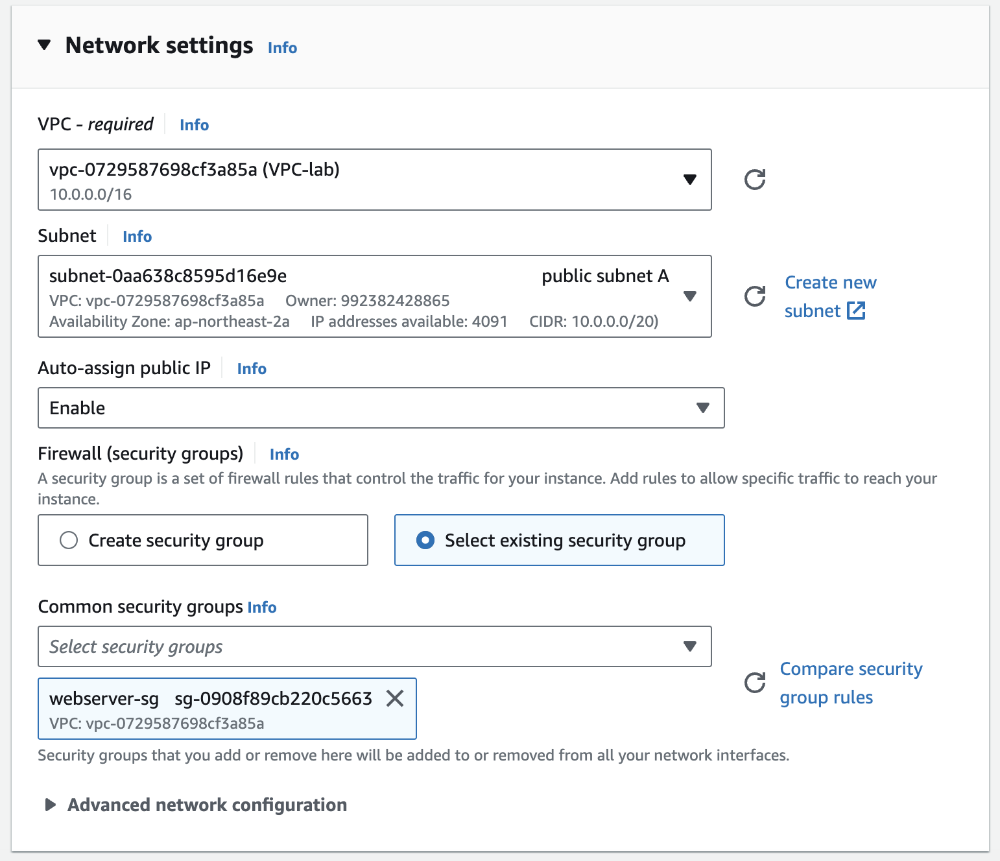

### Advanced wetwork configuration

보통 이 탭에 있는 옵션을 건드릴 일이 많이 없지만, 여기서는 빠른 데모를 위해서 사용자 데이터를
넣어준다.

> 사용자 데이터란?
> EC2 인스턴스가 만들어질 때 사용자 데이터에 있는 명령어들이 자동으로 실행되도록 하는 기능

실습에서 사용하는 사용자 데이터

```shell
#!/bin/sh

#Install a LAMP stack
dnf install -y httpd wget php-fpm php-mysqli php-json php php-devel
dnf install -y mariadb105-server
dnf install -y httpd php-mbstring

#Start the web server
chkconfig httpd on
systemctl start httpd

#Install the web pages for our lab
if [ ! -f /var/www/html/immersion-day-app-php7.zip ]; then
   cd /var/www/html
   wget -O 'immersion-day-app-php7.zip' 'https://static.us-east-1.prod.workshops.aws/public/ee7a15d7-cf08-44bc-9101-646bd274b766/assets/immersion-day-app-php7.zip'
   unzip immersion-day-app-php7.zip
fi

#Install the AWS SDK for PHP
if [ ! -f /var/www/html/aws.zip ]; then
   cd /var/www/html
   mkdir vendor
   cd vendor
   wget https://docs.aws.amazon.com/aws-sdk-php/v3/download/aws.zip
   unzip aws.zip
fi

# Update existing packages
dnf update -y
```

여기까지 했다면 오른쪽의 Launch instance 버튼을 클릭하여 EC2 인스턴스를 생성한다.
버튼을 클릭하고 약 2~3분 기다리면 생성한 EC2 instance가 실행되는 것을 볼 수 있다.

### 생성한 EC2 인스턴스가 running 이라면 퍼블릭 아이피로 잘 실행되고 있는 것 확인

퍼블릭 아이피를 복사하고 http://\<publicIP\> 를 브라우저에서 확인한다.

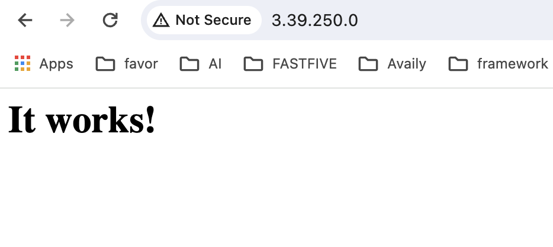

### 현재까지의 아키텍쳐

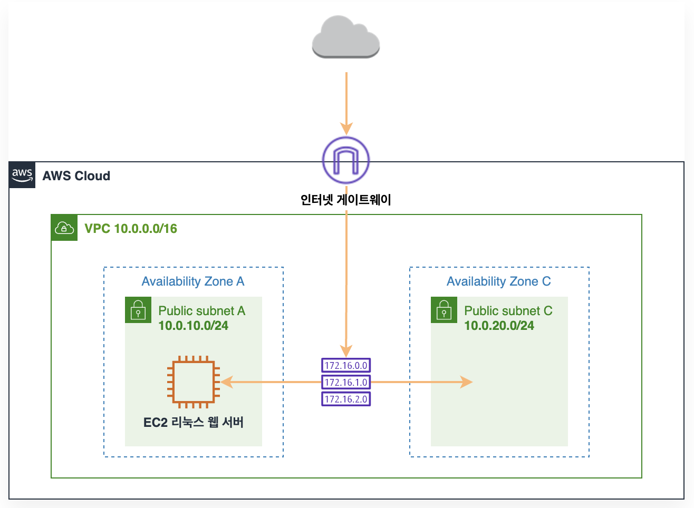

---

## AMI(Amazon Machine Image) 생성

AMI는 미리 생성된 EC2인스턴스의 이미지를 만들어, 같은 환경의 EC2 instance를 빠르게 만들 수
있는 기능을 제공한다. 즉, 동일한 구성의 인스턴스가 여러 개 필요할 때 하나의 AMI를 사용하여
여러 인스턴스를 빠르게 시작할 수 있다.

생성한 EC2 인스턴스 클릭 후 AMI 이미지 생성하기

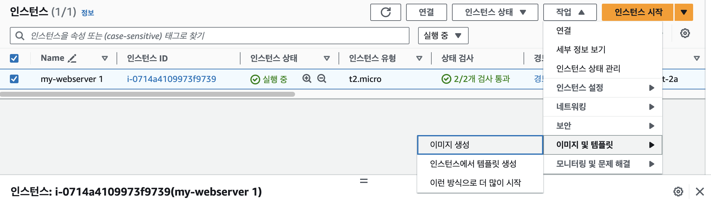

AMI 정보 설정
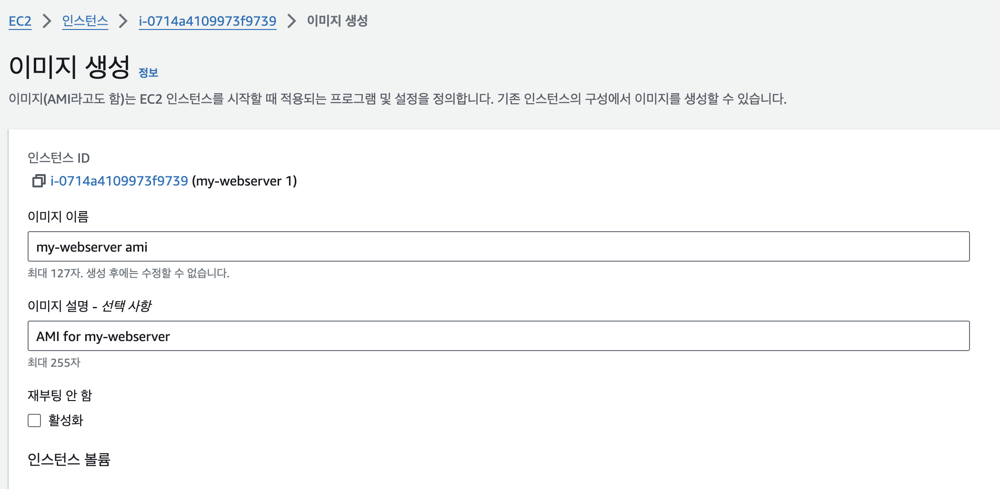

AMI 생성 확인
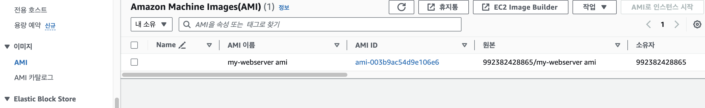

현재까지 아키텍쳐
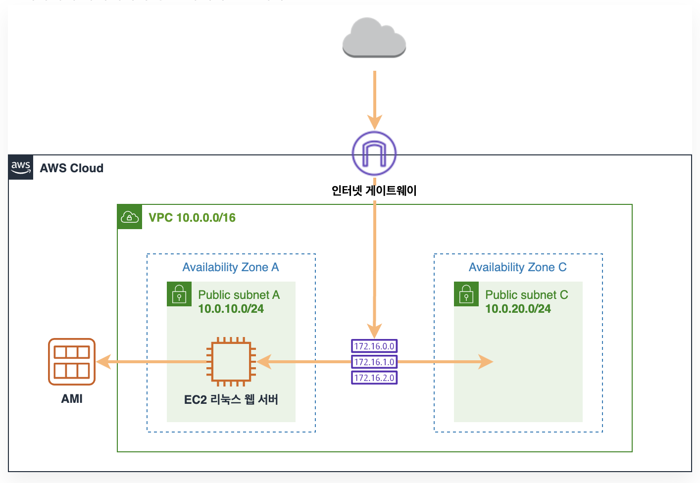

---

## AMI를 사용하여 두번 째 EC2 인스턴스 생성

### 사이드의 AMI 탭에서 생성된 이미지 선택 후 AMI로 인스턴스 시작 클릭

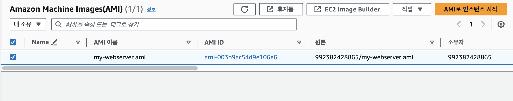

### my-webserver 2 생성

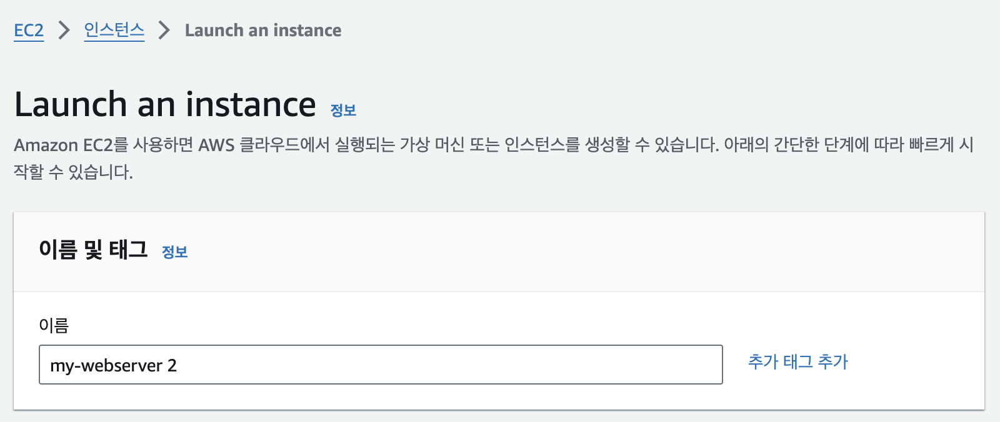

인스턴스 유형은 선택할 수 있지만 앞에서 만들었던 것과 똑같이 만든다.
더불어 키페어도 똑같이 설정한다.

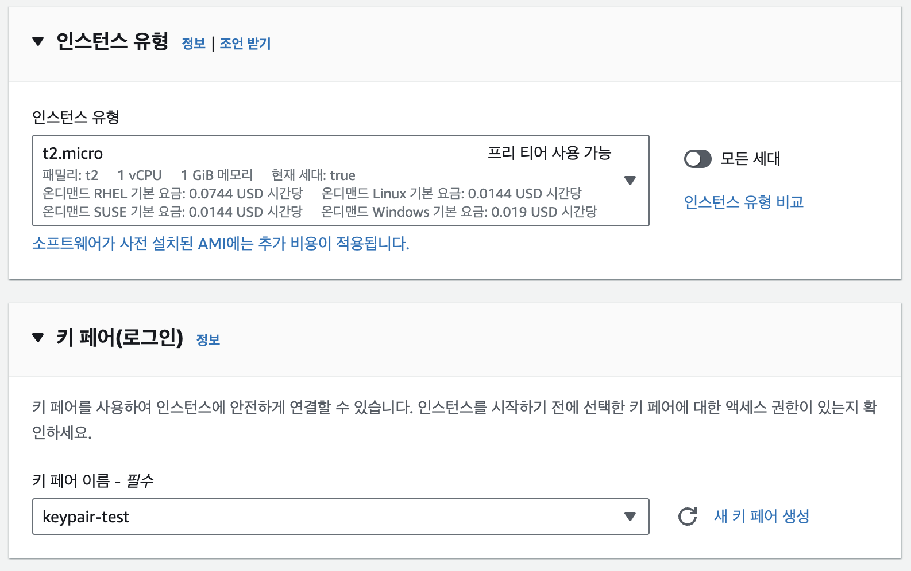

네트워크 설정도 똑같이 하되 subnet 을 **public subnet C** 로 설정한다.

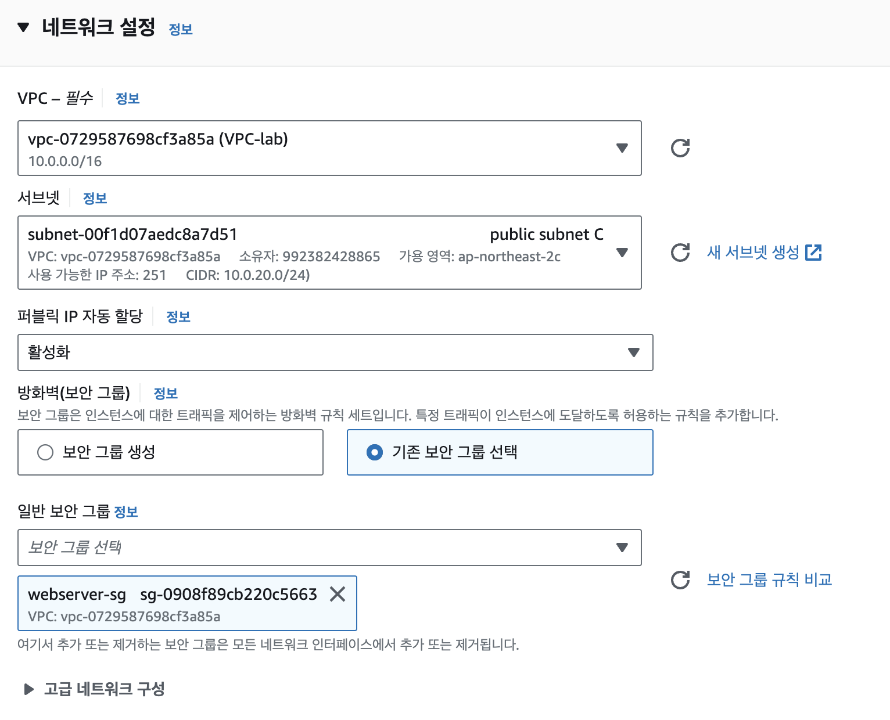

EC2 인스턴스가 2개가 만들었다.
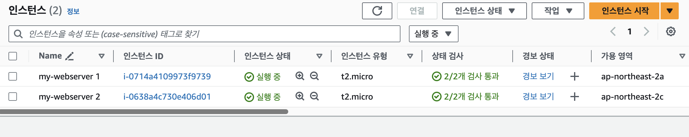

가용영역(AZ) 및 서브넷 확인
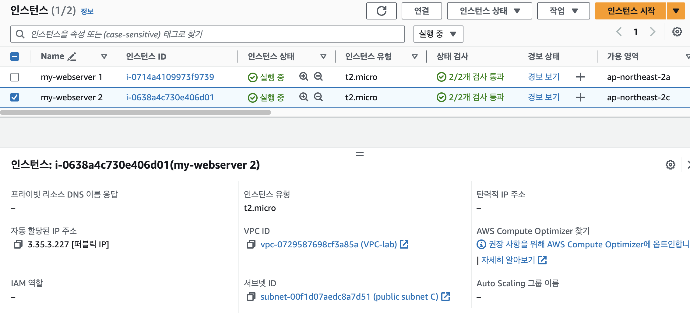

현재까지 아키텍쳐

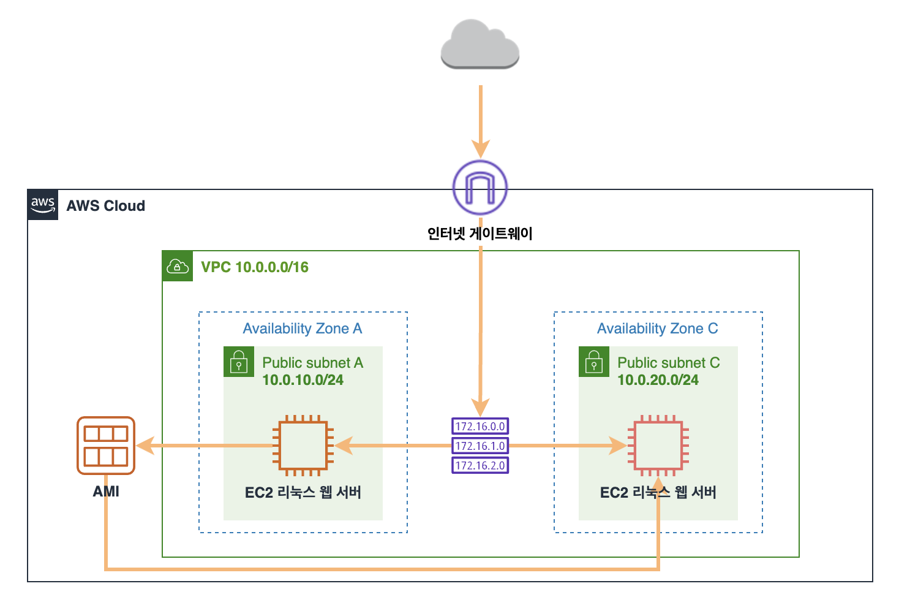
