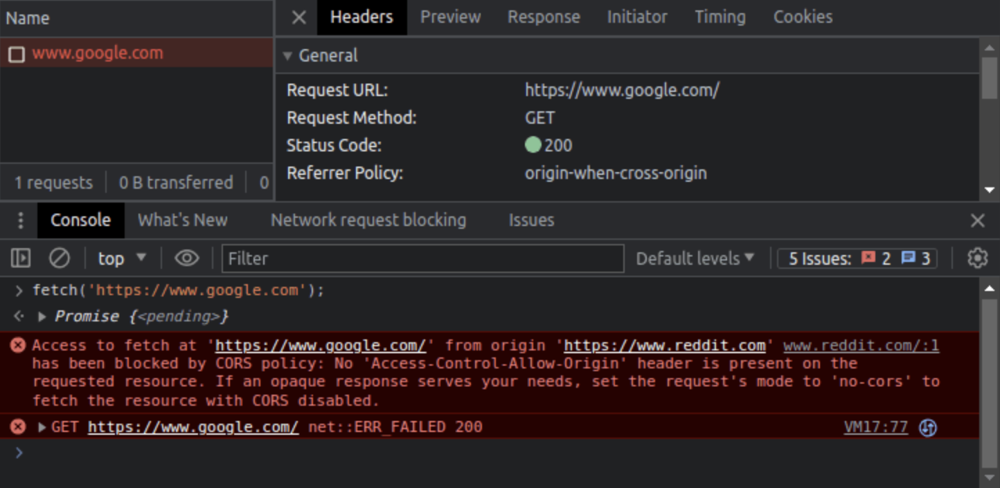

# CORS

## CORS(Cross-Origin Resource Sharing, 교차 출처 리소스 공유)

- 다른 출처에서 리소스를 요청하는 것을 허용하거나 거부하는 메커니즘이다.
- 웹 브라우저에 내장되어 있다.
- HTTP 헤더를 기반으로 교차 출처 요청을 허용하는 것이 안전한지 여부를 결정합니다.

## What is Origin

Origin 은 다음으로 구성된 URL의 일부이다.

- 프로토콜(ex: HTTP, HTTPS, ...)
- 도메인(ex: google.com)
- 포트(ex: 443 - SSL(Secure Sockets Layer)을 위한 기본 포트번호)

위의 구성으로 https://google.com:443 과 같이 Origin을 구성한다.

HTTPS의 기본 포트는 443이므로 https://google.com 로 단축 할 수 있다.

Origin이 동일한 URL의 예시

- https://google.com
- https://google.com:443
- https://google.com/search?q=test

Origin이 동일하지 않은 URL의 예시

- https://google.com:8080
- https://www.google.com
- http://google.com
- https://reddit.com

## 동일 출처 정책

브라우저를 사용하여 특정 웹사이트에 HTTP 요청을 하면 요청하는 웹사이트에 속한 쿠키가 첨부되는데,
이 쿠키에는 올바른 이메일과 비밀번호를 사용하여 로그인했음을 증명할 수 있는 JWT 토큰과 같은 매우 민감한
데이터가 포함되어 있는 경우가 많다.

- 웹사이트에서 다른 출처의 리소스를 요청할 때마다 이를 교차 출처 요청으로 간주합니다.
- 웹 브라우저는 이러한 요청을 제한하는 동일 출처 정책을 구현합니다.
- 동일 출처 정책은 두 웹 페이지의 출처가 동일한 경우에만 한 페이지가 다른 페이지의 데이터에 액세스할 수
  있도록 허용합니다.
- 따라서 악성 웹사이트나 스크립트가 쿠키를 사용하여 로그인한 다른 웹사이트에서 작업을 수행하는 것을
  방지하는 보호 계층 중 하나로 작용합니다.

> 알아두면 유용한 또 다른 보안 메커니즘은 SameSite 플래그이다.

## Preflight requests

교차 출처 요청이 이루어진 후 브라우저가 응답을 거부하고 API가 적절한 헤더로 응답하지 않았다는 것을
브라우저가 알아차렸다는 점을 이해하는 것이 중요하다. 브라우저가 거부하기 전에 악의적인 교차 출처 요청이
이미 애플리케이션에 일부 피해를 입혔을 가능성이 있다.

이러한 위험을 일부 완화하기 위해 브라우저에는 프리플라이트 요청 메커니즘이 포함되어 있다.

특정 상황에서 특정 HTTP 메서드나 헤더를 포함하는 교차 출처 요청을 할 때 브라우저는 실제 HTTP 요청을
하기 전에 프리플라이트 요청한다. 소위 단순 요청을 할 때는 그렇게 하지 않는다.

단순 요청이란 GET, HEAD 또는 POST 메서드를 사용하고 다른 헤더를 포함하지 않는 요청을 말한다.
