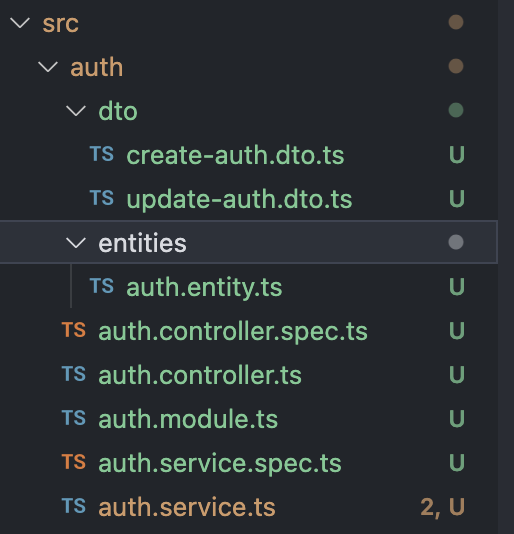

# 03.controller

컨트롤러의 목적은 애플리케이션에 대한 특정 요청을 수신하는 것이다.
따라서, 수신 요청을 처리하고 클라이언트에 응답을 반환한다.

## CRUD 빠르게 만들기

src 폴더에서 아래의 명령어를 실행한다.

```shell
nest g resource [name]
```

REST API를 선택한다.

```shell
? What transport layer do you use?
❯ REST API
GraphQL (code first)
GraphQL (schema first)
Microservice (non-HTTP)
WebSockets

? Would you like to generate CRUD entry points? (Y/n) y
```

이렇게 하면 기본 CRUD 모듈이 만들어진다. 여기서는 name 에 auth 를 주었다.



controller, service 등을 따로따로 만들고 싶다면, resource 가 아닌 controller, service
를 직접 명시하여 생성할 수 있다.

```shell
nest g controller [name]
```

## 기본 controller 의 모습

```ts
import { Controller, Get } from '@nestjs/common';

@Controller('cats')
export class CatsController {
  @Get()
  findAll(): string {
    return 'This action returns all cats';
  }
}
```

## Request 객체를 받는 모습

```ts
import { Controller, Get, Req } from '@nestjs/common';
import { Request } from 'express';

@Controller('cats')
export class CatsController {
  @Get()
  findAll(@Req() request: Request): string {
    return 'This action returns all cats';
  }
}
```

## Route wildcards

```shell
@Get('ab*cd')
findAll() {
  return 'This route uses a wildcard';
}
```

## ETC

- @Req()
- @Res()
- @Next()
- @Session()
- @Param(key?: string)
- @Body(key?: string)
- @Query(key?: string)
- @Headers(name?: string)
- @Ip()
- @HostParam()
- @Redirect()

## scope

> Node.js는 모든 요청이 별도의 스레드에서 처리되는 요청/응답 다중 스레드 무상태 모델을 따르지 않는다.
>
> 따라서 싱글톤 인스턴스를 사용하는 것은 애플리케이션에 완전히 안전합니다.

라고 공식문서에 나와있다. 이 말은 각 module은 기본적으로 singleton 이라는 것이다.

그러나 GraphQL 애플리케이션의 요청별 캐싱, 요청 추적 또는 멀티테넌시 등 컨트롤러의 요청 기반 수명이
바람직한 동작일 수 있는 엣지 케이스는 scope를 제어해야 한다.

이것은 따로 자세히 다뤄야 하는 내용이므로 여기서는 일단 넘어간다.

## Request Payload

```ts
export class CreateCatDto {
  name: string;
  age: number;
  breed: string;
}
```

```ts
@Post()
async create(@Body() createCatDto: CreateCatDto) {
  return 'This action adds a new cat';
}
```

## Full Code of Controller

```ts
import {
  Controller,
  Get,
  Query,
  Post,
  Body,
  Put,
  Param,
  Delete,
  Bind,
} from '@nestjs/common';

@Controller('cats')
export class CatsController {
  @Post()
  @Bind(Body())
  create(createCatDto) {
    return 'This action adds a new cat';
  }

  @Get()
  @Bind(Query())
  findAll(query) {
    console.log(query);
    return `This action returns all cats (limit: ${query.limit} items)`;
  }

  @Get(':id')
  @Bind(Param('id'))
  findOne(id) {
    return `This action returns a #${id} cat`;
  }

  @Put(':id')
  @Bind(Param('id'), Body())
  update(id, updateCatDto) {
    return `This action updates a #${id} cat`;
  }

  @Delete(':id')
  @Bind(Param('id'))
  remove(id) {
    return `This action removes a #${id} cat`;
  }
}
```

## 등록하기

만들어진 Controller 는 AppModule에 반드시 등록해야 한다.

```ts
import { Module } from '@nestjs/common';
import { CatsController } from './cats/cats.controller';

@Module({
  controllers: [CatsController],
})
export class AppModule {}
```
