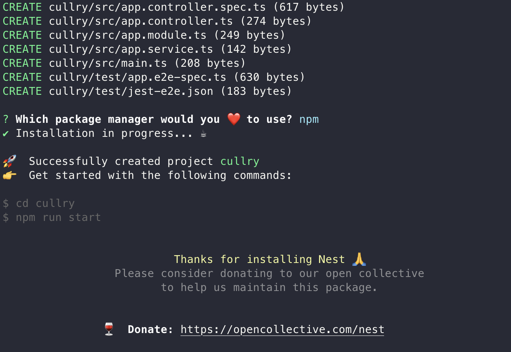
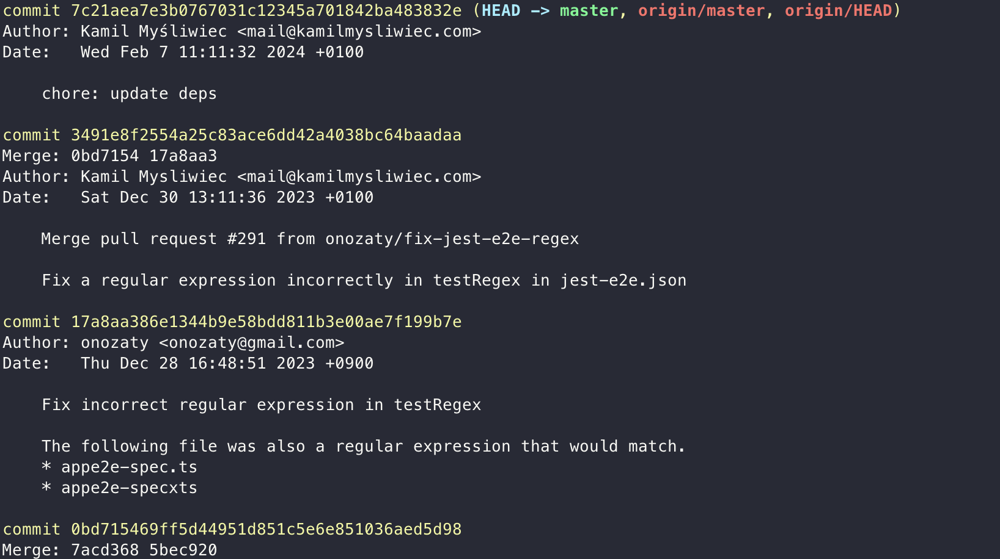

# Intro Installation

## Intro-installation

## NestJS installation

- NestJS는 효율적이고 확장 가능한 Node.js 서버 측 애플리케이션을 구축하기 위한 프레임워크이다.
- 이 프레임워크는 프로그레시브 자바스크립트를 사용하며, 타입스크립트로 구축되고 완벽하게 지원한다.
- 순수 자바스크립트로 코딩할 수 있으며, OOP(객체 지향 프로그래밍), FP(함수형 프로그래밍),
  FRP(기능적 반응형 프로그래밍)의 요소를 결합한다.
- 내부적으로 Express(기본값)와 같은 강력한 HTTP 서버 프레임워크를 사용하며, 선택적으로 Fastify도
  사용하도록 구성할 수 있다.
- Nest는 이러한 일반적인 Node.js 프레임워크(Express/Fastify)보다 높은 수준의 추상화를 제공하고,
  해당 API를 개발자에게 직접 노출합니다. 따라서 개발자는 기본 플랫폼에서 사용할 수 있는 수많은 타사
  모듈을 자유롭게 사용할 수 있다.

## 철학

- Node(및 서버 측 JavaScript)를 위한 아키텍처라는 주요 문제를 효과적으로 해결한다.
- Nest는 개발자와 팀이 고도로 테스트 가능하고, 확장 가능하며, 느슨하게 결합되고, 쉽게 유지 관리할 수 있는
  애플리케이션을 만들 수 있는 기본 애플리케이션 아키텍처를 제공한다.
- 이 아키텍처는 Angular에서 많은 영감을 받았다.

## 설치

### nestjs 의 cli 를 사용할 수 있도록 전역에 설치

```shell
npm i -g @nestjs/cli
```

### TypeScript로 시작

TypeScript 프로젝트를 만들려면 nest new 명령에 --strict 플래그를 전달한다.

```shell
nest new --strict [project-name]
```

```shell
? Which package manager would you ❤️  to use? (Use arrow keys)
> npm
```

프로젝트가 생성되었다.



### Alternatives

또는 Git을 사용하여 TypeScript 스타터 프로젝트를 설치한다.

```shell
git clone https://github.com/nestjs/typescript-starter.git project
cd project
npm install
npm run start
```

단, Git에서 Clone 하여 설치하면 git history까지 고스란히 가져오게 된다.



공식문서에서는 이것을 회피하기 위해서 degit을 사용하는 것을 권장한다.

#### degit 설치 후 typescript-starter 설치

👉 [degit](https://github.com/Rich-Harris/degit)

👉 [nestjs-typescript-starter](https://github.com/nestjs/typescript-starter)

degit 설치

```shell
npm install -g degit
```

degit으로 설치

````shell
degit git@gitub.com:nestjs/typescript-starter.git [project-name]
```h

이렇게 설치한 후에 프로젝트에 들어가서 git log를 보면 history 가 깨끗한 것을 볼 수 있다.
````

여기서는 --strict 를 사용하여 초기 프로젝트를 설치하였다.

그 후, 프로젝트의 기본 구조는 아래와 같다.


.eslintrc.js 와 .prettierrc 도 마련되어있다.

package.json 은 아래와 같이 마련되어있다.

```json
{
  "name": "project",
  "version": "0.0.1",
  "description": "",
  "author": "",
  "private": true,
  "license": "UNLICENSED",
  "scripts": {
    "prebuild": "rimraf dist",
    "build": "nest build",
    "format": "prettier --write \"src/**/*.ts\" \"test/**/*.ts\"",
    "start": "nest start",
    "start:dev": "nest start --watch",
    "start:debug": "nest start --debug --watch",
    "start:prod": "node dist/main",
    "lint": "eslint \"{src,apps,libs,test}/**/*.ts\" --fix",
    "test": "jest",
    "test:watch": "jest --watch",
    "test:cov": "jest --coverage",
    "test:debug": "node --inspect-brk -r tsconfig-paths/register -r ts-node/register node_modules/.bin/jest --runInBand",
    "test:e2e": "jest --config ./test/jest-e2e.json"
  },
  "dependencies": {
    "@nestjs/common": "^9.0.0",
    "@nestjs/core": "^9.0.0",
    "@nestjs/platform-express": "^9.0.0",
    "reflect-metadata": "^0.1.13",
    "rimraf": "^3.0.2",
    "rxjs": "^7.2.0"
  },
  "devDependencies": {
    "@nestjs/cli": "^9.0.0",
    "@nestjs/schematics": "^9.0.0",
    "@nestjs/testing": "^9.0.0",
    "@types/express": "^4.17.13",
    "@types/jest": "28.1.4",
    "@types/node": "^16.0.0",
    "@types/supertest": "^2.0.11",
    "@typescript-eslint/eslint-plugin": "^5.0.0",
    "@typescript-eslint/parser": "^5.0.0",
    "eslint": "^8.0.1",
    "eslint-config-prettier": "^8.3.0",
    "eslint-plugin-prettier": "^4.0.0",
    "jest": "28.1.2",
    "prettier": "^2.3.2",
    "source-map-support": "^0.5.20",
    "supertest": "^6.1.3",
    "ts-jest": "28.0.5",
    "ts-loader": "^9.2.3",
    "ts-node": "^10.0.0",
    "tsconfig-paths": "4.0.0",
    "typescript": "^4.3.5"
  },
  "jest": {
    "moduleFileExtensions": ["js", "json", "ts"],
    "rootDir": "src",
    "testRegex": ".*\\.spec\\.ts$",
    "transform": {
      "^.+\\.(t|j)s$": "ts-jest"
    },
    "collectCoverageFrom": ["**/*.(t|j)s"],
    "coverageDirectory": "../coverage",
    "testEnvironment": "node"
  }
}
```

Cool 😎

## main.ts

main.ts는 Nest 애플리케이션의 앤트리 파일이 된다.

```ts
// main.ts
import { NestFactory } from '@nestjs/core';
import { AppModule } from './app.module';

async function bootstrap() {
  const app = await NestFactory.create(AppModule);
  await app.listen(3000);
}
bootstrap();
```

기본적으로 애플리케이션을 만드는 동안 오류가 발생하면 앱은 코드 1과 함께 종료된다. 오류를 발생시키려면
abortOnError 옵션을 비활성한다.

```ts
...
async function bootstrap() {
  const app = await NestFactory.create(AppModule, { abortOnError: false });
  ...
}
```

## 실행

```shell
npm run start
```

개발 프로세스 속도를 높이려면(빌드 속도가 20배 빨라짐) 다음과 같이 package.json을 수정한다.

```json
...
"start": "nest start -- -b swc",
...
```

파일의 변경사항을 즉시 적용시키면서 개발하려면 아래의 명령어로 실행한다.

```shell
npm run start:dev
```

## Ref - [공식문서](https://docs.nestjs.com/)
