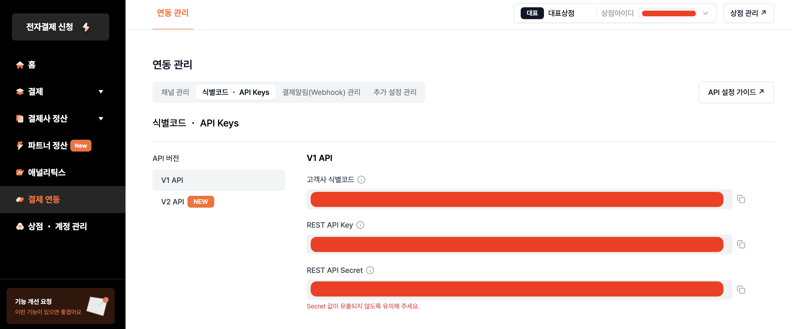
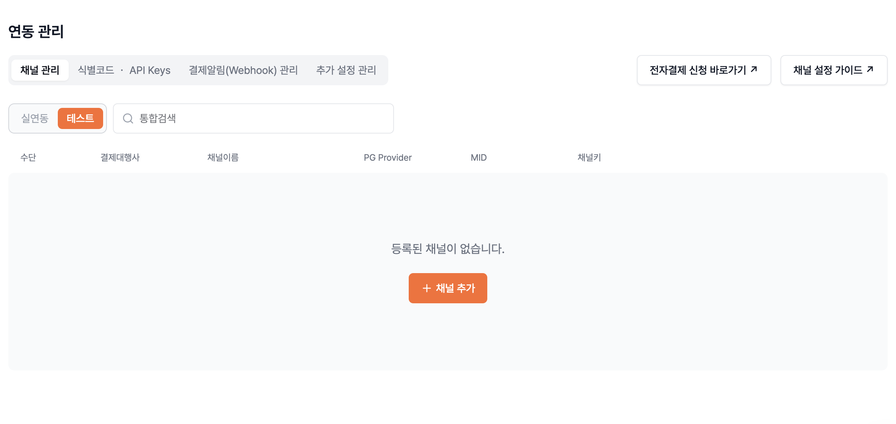
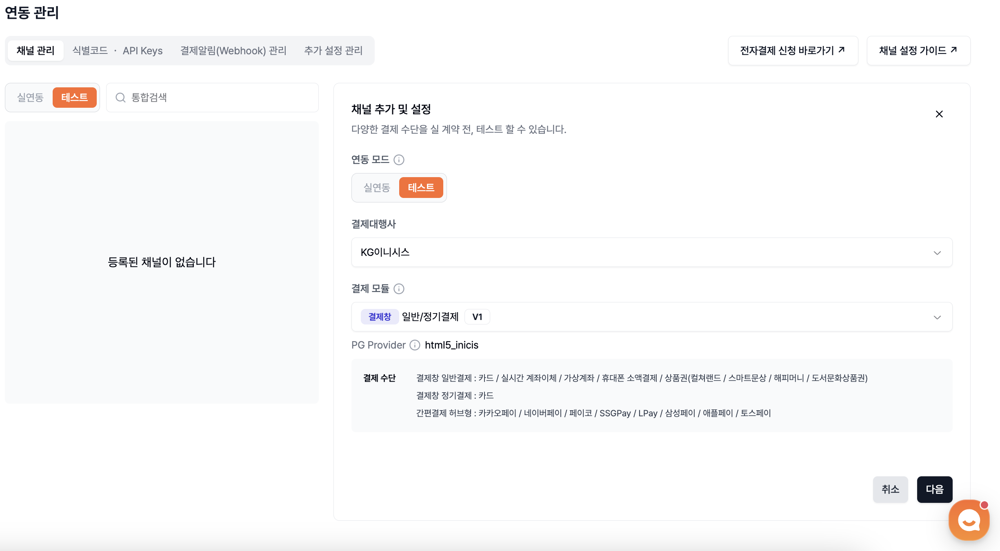
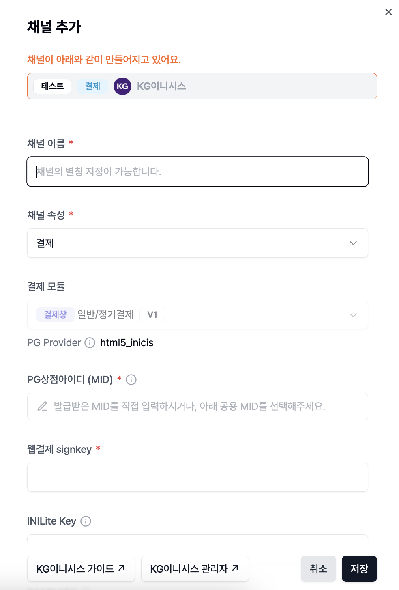
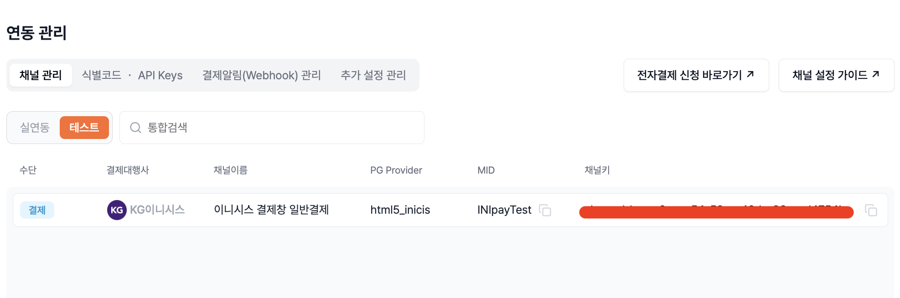

# 포트원(PortOne)

## 포트원(PortOne, 구 import) 사용하여 결제 API 연동하기

포트원 API를 사용하여 결제 기능을 구현하기 위해 먼저 포트원에 가입을 진행한다.

### 결제에 필요한 정보

포트원 API를 호출하기 위해서 몇 가지 필요한 정보가 있다.

#### 1. 고객사 식별코드

가입하면 자동으로 부여받는다.

왼쪽 메뉴의 **상점 ・ 계정 관리** > 상단의 **내 식별코드 ・ API Keys** 에서 확인할 수 있다.



#### 2. 상점 아이디

채널을 추가해야 한다.



연동모드를 테스트로 하고, 결제 대행사 및 결제 모듈을 선택한다. 여기서는 KG이니시스, 일반/정기결제 V1
을 선택하였다. 이 때, 하단의 PG Provider를 복사한다.

> PG Provider는 결제 대행사마다 다르다.



- 이제 채널에 대한 구체적이 정보를 적어준다.
- PG상점 아이디(MID)는 선택할 수 있는데, 테스트 연동이라면 INIBillTst 와 INIPayTest 를 선택할
  수 있다. 여기서는 그냥 INIPayTest 를 선택한다.
- 과세구분 (부가세 신고 참고 자료용)은 어차피 테스트이기 때문에 미설정으로 하고 저장 버튼 클릭



채널 생성 확인



---

## 프로젝트에 세팅하기

### 1. 아래와 같이 index.html에 import.js 모듈을 로드할 수 있도록 세팅하자.

```js
<body>
  <div id='root'></div>
  <script src='https://cdn.iamport.kr/v1/iamport.js'></script>
  <script type='module' src='./src/main.tsx'></script>
</body>
```

### 2. main.tsx 에서 가맹점 식별코드 세팅

```tsx
function main() {
  // PortOne initialization
  Reflect.get(window, 'IMP').init(process.env.PORTONE_IMP);

  // ...
}
```

환경 변수는 아래와 같은 형태로 설정

```.env
# 고객사 식별코드
PORTONE_IMP=imp999999

# PG사 코드 + 상점 아이디
PORTONE_PG_CODE=html5_inicis.INIpayTest
```

### 3. PaymentService 를 만들고 portone 문서를 참고하여 결제 API 요청 코드를 만들 수 있다

```ts
@singleton()
export default class PaymentService {
  private instance = Reflect.get(window, 'IMP');

  async requestPayment({
    merchantId,
    product,
    buyer,
  }: {
    merchantId: string;
    product: Product;
    buyer?: Buyer;
  }): Promise<{
    merchantId: string;
    transactionId: string;
  }> {
    return new Promise((resolve, reject) => {
      this.instance.request_pay(
        {
          pg: PG_CODE,
          pay_method: 'card',
          merchant_uid: merchantId,
          name: product.name,
          amount: product.price,
          buyer_email: buyer?.email,
          buyer_name: buyer?.name,
          buyer_tel: buyer?.phoneNumber,
          buyer_addr: buyer?.address,
          buyer_postcode: buyer?.postalCode,
        },
        (response: PaymentResponse) => {
          if (response.success) {
            resolve({
              merchantId: response.merchant_uid,
              transactionId: response.imp_uid ?? '',
            });
          } else {
            reject(Error(response.error_msg));
          }
        },
      );
    });
  }
}

export const paymentService = container.resolve(PaymentService);
```

눈여겨 봐야 할 부분은 request_pay의 객체로 들어가는 부분이다.

- merchant_uid: portone 에 전달해야 할 유니크한 값이고, 사용하는 쪽에서 만들어줘야 한다.
  유니크한 키를 생성한 후에 DB에 저장하는 것이 좋다.
- pay_method: 기본적으로 cart 로 진행. 카카오페이 간편결제 기능도 cart 로 가능하다.

> 프론트에서 결제 요청을 보낸 뒤 금액 위변조 체크 같은 것을 해야하고, 이것은 백엔드에서 수행하는 것이
> 좋다. 위변조 체크 후, 금액이 맞지 않을 경우 환불 등의 API 콜을 수행해야 할 수도 있고,
> 요구 조건에 맞게 구현이 달라지겠다.
> 결제 요청을 하기 전에 DB에 결제 정보를 저장을 할지, 결제 성공후에 DB에 저장을 할지도 선택할 수 있고
> 플로우에 따라서 DB 구성도 달라질 수 있겠다.
