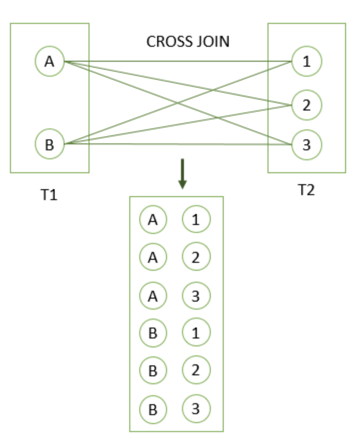
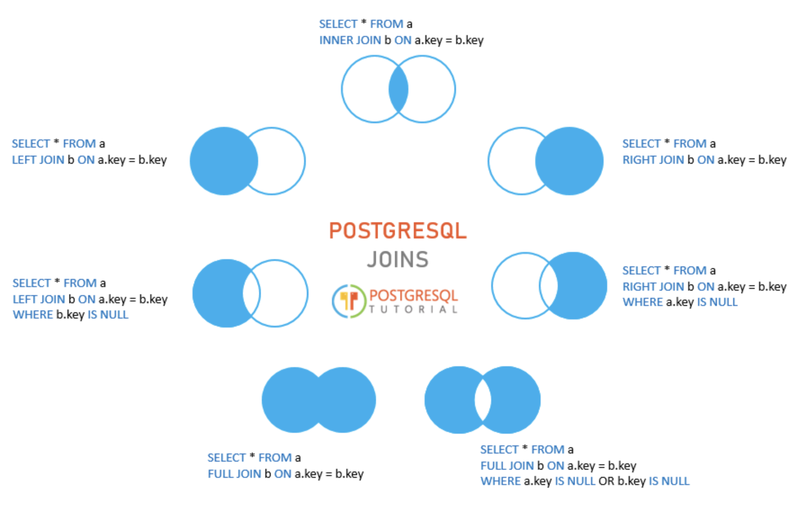

# JOIN

```sql
CREATE TABLE basket_a (
    a INT PRIMARY KEY,
    fruit_a VARCHAR (100) NOT NULL
);

CREATE TABLE basket_b (
    b INT PRIMARY KEY,
    fruit_b VARCHAR (100) NOT NULL
);

INSERT INTO basket_a (a, fruit_a)
VALUES
    (1, 'Apple'),
    (2, 'Orange'),
    (3, 'Banana'),
    (4, 'Cucumber');

INSERT INTO basket_b (b, fruit_b)
VALUES
    (1, 'Orange'),
    (2, 'Apple'),
    (3, 'Watermelon'),
    (4, 'Pear');

 a | fruit_a
---+----------
 1 | Apple
 2 | Orange
 3 | Banana
 4 | Cucumber
(4 rows)

 b |  fruit_b
---+------------
 1 | Orange
 2 | Apple
 3 | Watermelon
 4 | Pear
(4 rows)
```

## INNER JOIN

```sql
SELECT
    a,
    fruit_a,
    b,
    fruit_b
FROM
    basket_a
INNER JOIN basket_b
    ON fruit_a = fruit_b;

 a | fruit_a | b | fruit_b
---+---------+---+---------
 1 | Apple   | 2 | Apple
 2 | Orange  | 1 | Orange
(2 rows)
```

## LEFT JOIN

```sql
SELECT
    a,
    fruit_a,
    b,
    fruit_b
FROM
    basket_a
LEFT JOIN basket_b
   ON fruit_a = fruit_b;

 a | fruit_a  |  b   | fruit_b
---+----------+------+---------
 1 | Apple    |    2 | Apple
 2 | Orange   |    1 | Orange
 3 | Banana   | null | null
 4 | Cucumber | null | null
(4 rows)

SELECT
    a,
    fruit_a,
    b,
    fruit_b
FROM
    basket_a
LEFT JOIN basket_b
    ON fruit_a = fruit_b
WHERE b IS NULL;

 a | fruit_a  |  b   | fruit_b
---+----------+------+---------
 3 | Banana   | null | null
 4 | Cucumber | null | null
(2 rows)
```

> LEFT JOIN과 LEFT OUTER JOIN은 동일하므로 서로 바꿔서 사용할 수 있다.

## RIGHT JOIN

RIGHT JOIN은 오른쪽 테이블에서 데이터 선택을 시작한다.

```sql
SELECT
    a,
    fruit_a,
    b,
    fruit_b
FROM
    basket_a
RIGHT JOIN basket_b ON fruit_a = fruit_b;

  a   | fruit_a | b |  fruit_b
------+---------+---+------------
    2 | Orange  | 1 | Orange
    1 | Apple   | 2 | Apple
 null | null    | 3 | Watermelon
 null | null    | 4 | Pear
(4 rows)

SELECT
    a,
    fruit_a,
    b,
    fruit_b
FROM
    basket_a
RIGHT JOIN basket_b
   ON fruit_a = fruit_b
WHERE a IS NULL;

  a   | fruit_a | b |  fruit_b
------+---------+---+------------
 null | null    | 3 | Watermelon
 null | null    | 4 | Pear
(2 rows)
```

> RIGHT JOIN과 RIGHT OUTER JOIN은 동일하므로 서로 바꿔서 사용할 수 있다.

## FULL OUTER JOIN

왼쪽 오른쪽 모든 행이 포함된 결과 집합을 반환하며, 일치하는 항목이 없는 경우 테이블 행은 NULL

```sql
SELECT
    a,
    fruit_a,
    b,
    fruit_b
FROM
    basket_a
FULL OUTER JOIN basket_b
    ON fruit_a = fruit_b;

  a   | fruit_a  |  b   |  fruit_b
------+----------+------+------------
    1 | Apple    |    2 | Apple
    2 | Orange   |    1 | Orange
    3 | Banana   | null | null
    4 | Cucumber | null | null
 null | null     |    3 | Watermelon
 null | null     |    4 | Pear
(6 rows)

SELECT
    a,
    fruit_a,
    b,
    fruit_b
FROM
    basket_a
FULL JOIN basket_b
   ON fruit_a = fruit_b
WHERE a IS NULL OR b IS NULL;

  a   | fruit_a  |  b   |  fruit_b
------+----------+------+------------
    3 | Banana   | null | null
    4 | Cucumber | null | null
 null | null     |    3 | Watermelon
 null | null     |    4 | Pear
(4 rows)
```

## Cross JOIN

- 집합 이론에서 교차 조인은 두 테이블의 행의 데카르트곱 곱을 생성
- 교차 조인은 대규모 결과 집합을 생성할 수 있으므로 성능 문제를 피하기 위해 신중하게 사용

```sql
-- 기본 구문
SELECT
  select_list
FROM
  table1
CROSS JOIN table2;

-- 기본 구문과 같음
SELECT
  select_list
FROM
  table1,table2;

-- 또는 항상 true로 평가되는 조건과 함께 INNER JOIN 절을 사용하여 교차 조인을 시뮬레이션
SELECT
  select_list
FROM
  table1
  INNER JOIN table2 ON true;
```



## SELF JOIN

```sql
CREATE TABLE employee (
  employee_id INT PRIMARY KEY,
  first_name VARCHAR (255) NOT NULL,
  last_name VARCHAR (255) NOT NULL,
  manager_id INT,
  FOREIGN KEY (manager_id) REFERENCES employee (employee_id) ON DELETE CASCADE
);
INSERT INTO employee (employee_id, first_name, last_name, manager_id)
VALUES
  (1, 'Windy', 'Hays', NULL),
  (2, 'Ava', 'Christensen', 1),
  (3, 'Hassan', 'Conner', 1),
  (4, 'Anna', 'Reeves', 2),
  (5, 'Sau', 'Norman', 2),
  (6, 'Kelsie', 'Hays', 3),
  (7, 'Tory', 'Goff', 3),
  (8, 'Salley', 'Lester', 3);

SELECT * FROM employee;

 employee_id | first_name |  last_name  | manager_id
-------------+------------+-------------+------------
           1 | Windy      | Hays        |       null
           2 | Ava        | Christensen |          1
           3 | Hassan     | Conner      |          1
           4 | Anna       | Reeves      |          2
           5 | Sau        | Norman      |          2
           6 | Kelsie     | Hays        |          3
           7 | Tory       | Goff        |          3
           8 | Salley     | Lester      |          3
(8 rows)

SELECT
  e.first_name || ' ' || e.last_name employee,
  m.first_name || ' ' || m.last_name manager
FROM
  employee e
  INNER JOIN employee m ON m.employee_id = e.manager_id
ORDER BY
  manager;

    employee     |     manager
-----------------+-----------------
 Sau Norman      | Ava Christensen
 Anna Reeves     | Ava Christensen
 Salley Lester   | Hassan Conner
 Kelsie Hays     | Hassan Conner
 Tory Goff       | Hassan Conner
 Ava Christensen | Windy Hays
 Hassan Conner   | Windy Hays
(7 rows)

SELECT
  e.first_name || ' ' || e.last_name employee,
  m.first_name || ' ' || m.last_name manager
FROM
  employee e
  LEFT JOIN employee m ON m.employee_id = e.manager_id
ORDER BY
  manager;

    employee     |     manager
-----------------+-----------------
 Anna Reeves     | Ava Christensen
 Sau Norman      | Ava Christensen
 Salley Lester   | Hassan Conner
 Kelsie Hays     | Hassan Conner
 Tory Goff       | Hassan Conner
 Hassan Conner   | Windy Hays
 Ava Christensen | Windy Hays
 Windy Hays      | null
(8 rows)
```


