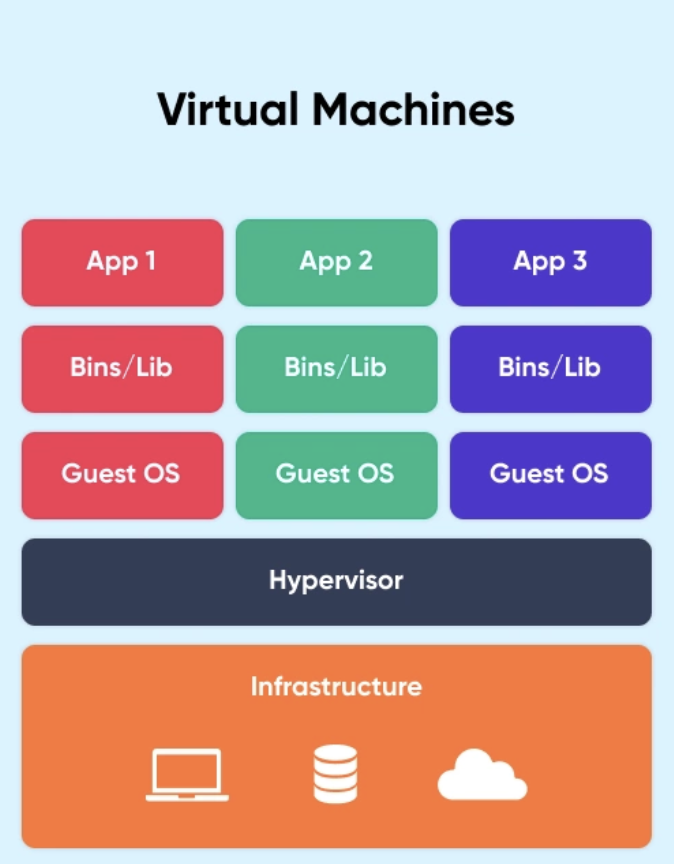
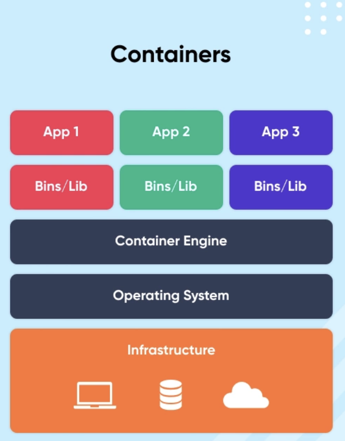
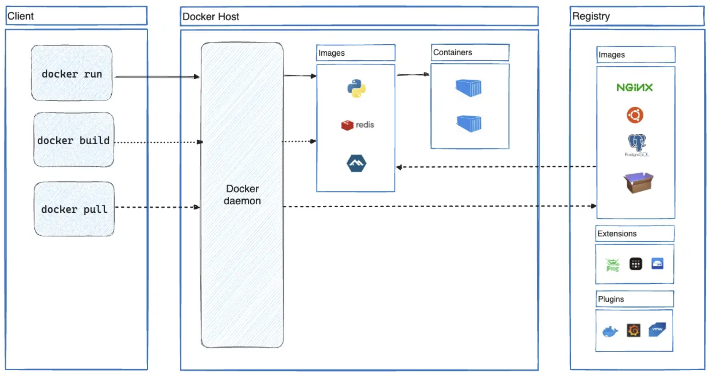

# Docker 개념 정리

## 도커(Docker)란 무엇인가?

도커는 **컨테이너 기반 가상화 도구**이며, **애플리케이션을 컨테이너라는 단위로 실행하고 배포**하는
기술이다. Go언어로 작성되었으며 리눅스 컨테이너 기반으로 하는 오픈소스 가상화 플랫폼이다.

조금 더 자세하게 설명하기 위해서는 몇 가지 알아야 하는 키워드가 있다.

- 가상화 기술
- 컨테이너

### 가상화 기술

가상화 기술은 하나의 컴퓨터를 여러 개의 컴퓨터를 사용하는 것 처럼 사용할 수 있게 하는 기술이다.
즉, 하나의 컴퓨터에서 다수의 가상 환경을 만들어 프로그램이나 운영 체제를 실행하는 기술이다.

예를 들어보자.

- 집에 한 대의 컴퓨터가 있다.
- 형제가 있거나 친구가 놀러왔을 때 여럿이서 컴퓨터를 사용하고 싶어한다.
- 그러나 컴퓨터는 한 번에 한 명의 사람만 사용할 수 있어 불편하다.

이 때 가상화 기술이 등장한다. 가상화 기술로 하나의 컴퓨터에서 여러 개의 가상 컴퓨터를 만든다.

가상 컴퓨터들은 각자의 공간에서 작업하기 때문에 서로 간섭하지 않고(격리된 환경), 각자 개인 공간에서
컴퓨터를 사용하는 것처럼 편리하게 사용할 수 있다. 어떤 사람은 게임을, 어떤 사람을 그림이나 숙제를 하듯이,
여러 명이 동시에 다양한 작업을 수행할 수 있다.

가상화 기술은 이러한 환경을 제공한다.

조금 어렵게는 다음과 같다.

- 하드웨어 리소스(프로세서, 메모리, 저장소 등)를 추상화 한다.
- 메모리, 하드웨어, 컨테이너, 네트워크를 가상화 한다.

### 가상 머신(Virtual Machine, VM) VS 컨테이너(Container)

가상화 기술에는 가상 머신 (Virtual Machine, VM)과 컨테이너(Container)방식이 존재하며, 각자
다른 접근 방식을 가지고 있다.

#### 가상 머신 (Virtual Machine, VM)

하나의 물리적인 컴퓨터 자원(CPU, 메모리, 저장장치 등)을 가상적으로 분할하여 여러 개의 가상 컴퓨터 환경을
만들어 내는 기술이며, 이를 통해 물리적인 컴퓨터 자원을 더욱 효율적으로 사용할 수 있다.

- 호스트 컴퓨터에서 **하이퍼바이저**라는 소프트웨어를 사용하여 여러 개의 독립적인 가상 환경을 생성
- 각 가상 머신은 완전한 운영 체제와 애플리케이션을 포함
- 호스트 컴퓨터의 자원을 가상적으로 할당받아 사용
- 각 VM은 자체 커널을 가지고 있으며, 호스트와는 완전히 격리된 환경에서 실행
- 가상 머신은 비교적 무겁고 느리지만, 다양한 운영 체제를 호스트하는 데 유용

> 하이퍼바이저(Hypervisor)란?
>
> - 가상 머신을 생성하고 구동하는 소프트웨어
> - OS에 자원을 할당 및 조율
> - OS들의 요청을 번역하여 하드웨어에 전달

핵심은 아래와 같다.

- 호스트의 자원을 가상적으로 할당받아 사용
- 자체 커널을 가지고 있으며, 완전한 운영 체제와 애플리케이션을 포함

#### 컨테이너(Container)

- 호스트 운영 체제 커널을 공유
- 여러 개의 격리된 프로세스를 실행하는 경량화된 방식
- 각 컨테이너는 응용 프로그램을 실행하는 데 필요한 모든 것을 포함하며, 호스트의 리소스를 공유하여 실행
- 가상 머신보다 가볍고 시작 시간이 빠르며, 자원 소비가 적음
- 각 컨테이너는 호스트와 컨테이너 간의 격리를 제공하며, 프로세스 수준의 격리를 통해 여러 응용 프로그램을
  동일한 호스트에서 안전하게 실행할 수 있음

핵심은 아래와 같다.

- 호스트의 리소스 공유
- 호스트 운영체제 위에 여러개의 격리된 환경(프로세스) 생성

#### 어떤 것을 선택해야 하는가?

가상 머신은 완전한 운영 체제 환경이 필요한 경우에 유용하며, 컨테이너는 경량화된 환경에서 응용 프로그램을
실행하고 관리하는데 효율적이다.

일반적으로 애플리케이션을 배포하기 위해서는 컨테이너가 선호된다.

#### 컨테이너는 VM에 비해서 왜 가볍고 빠른가?

##### 1. 공유 커널

컨테이너는 호스트 운영 체제의 커널을 공유하다. 반면, VM은 각각의 VM이 독립적인 운영 체제 커널을 가지고
있다. 이로 인해, 컨테이너는 VM보다 훨씬 적은 용량을 차지하며 시작 시간도 더 빠르다.

##### 2. 리소스 공유

컨테이너는 호스트 시스템의 자원을 공유해서 실행되지만, VM은 물리적은 자원을 할당 받아서 사용하기 때문에
더 많은 오버헤드가 발생한다. 이는 컨테이너가 가상 머신보다 더 효율적으로 자원을 활용할 수 있도록 해준다.

##### 3. 이미지 구조

컨테이너 이미지는 응용 프로그램과 그에 필요한 종속성만 포함하는 반면, VM 이미지는 완전한 운영 체제와
애플리케이션을 포함하고 있다. 따라서 컨테이너 이미지는 더 작고 가볍다.

##### 4. 가상화 계층의 차이

VM은 하이퍼바이저를 사용하여 호스트 시스템과 각 VM 사이의 추상화를 제공한다. 반면에 컨테이너는 호스트
운영 체제의 커널을 직접 사용하므로 더 적은 추상화 계층이 필요하다.
이는 더 적은 오버헤드와 더 빠른 성능을 가져온다.

차이점

- 가상화 레벨
  가상 머신: 하드웨어 레벨에서 가상화를 제공하며 각 가상 머신에는 고유의 OS가 있음.
  컨테이너: 운영체제 레벨에서 가상화를 제공하고 호스트 OS를 공유.
- 리소스 사용
  가상 머신: 완전히 독립된 환경을 제공하기 때문에 더 많은 리소스를 소비함.
  컨테이너: 가벼우며 필요한 리소스만 사용하여 훨씬 더 효율적임.
- 부팅 시간
  가상 머신: OS를 포함하므로 부팅에 더 긴 시간이 걸림.
  컨테이너: 가상 머신에 비해 월등한 속도로 (몇 초 내) 시작할 수 있음.
- 관리 및 유지보수
  가상 머신: OS를 포함하므로 패치, 보안 업데이트 등 관리가 더 복잡할 수 있음.
  컨테이너: 애플리케이션과 그 종속성만을 포함하므로 관리가 비교적 간단함.

## 그렇다면 다시 도커란 무엇인가

컨테이너 기반 가상화 도구이며, 애플리케이션을 컨테이너라는 단위로 격리하여 실행하고 배포하는 기술이다.
또한, 다양한 운영체제에서 사용할 수 있으며, 컨테이너화된 애플리케이션을 손쉽게 빌드, 배포, 관리할 수 있는
다양한 기능을 제공한다.

### 도커의 장점

- 표준화된 환경

  - 도커 컨테이너는 애플리케이션에 필요한 모든 종속성을 포함하여, 개발/프로덕션 환경이 동일해진다.
  - 어떤 컴퓨터에서든 동일한 환경을 제공하기 떄문에, 환경설정의 어려움이 없다.

- 이식성/유연성

  - 도커 컨테이너는 어디에서나 실행될 수 있기 때문에, 로컬 컴퓨터에서 컨테이너 안에서 개발하고,
    도커 이미지로 패키징하여 클라우드 또는 온프레미스 서버 혹은 다른 환경에서 실행이 가능하다.

- 자원 효율성

  - 도커 컨테이너는 가상 머신보다 가벼우며, 여러 개의 컨테이너를 하나의 호스트에서 실행할 수 있다.
  - 이는 더 많은 애플리케이션을 동일한 하드웨어 리소스로 실행할 수 있고, 자원의 효율성을 높일 수 있다.

- 빠른 배포 및 확장성
  - 도커는 애플리케이션을 컨테이너로 패키징하고 배포하고 확장하는 것이 간단하다.
  - 새로운 버전의 애플리케이션을 빠르게 배포하고 확장 가능하여, 트래픽 증가에도 대응할 수 있다.

## 도커 아키텍쳐(Docker Architecture)

- Docker Client
- Docker Host
- Docker Registry

### Docker Client

- 도커를 사용하기 위한 커맨드 라인 도구
- 도커 클라이언트를 통해 도커 호스트와 상호작용하고, 도커 이미지 및 컨테이너를 관리(시작/중지/삭제 등)
- docker 명령어를 사용하면 Docker daemon으로 보내어 실행

### Docker Host(Docker Server)

- 도커 컨테이너를 실행하는데 사용되는 가상 머신(도커 엔진이 설치되어 있는 가상 머신)
- 도커 이미지 저장, 컨테이너 실행, 도커 클라이언트와 통신
- 도커 데몬을 실행하여 컨테이너를 생성/시작/중지 및 관리를 수행하는 역할 수행
- 호스트 운영 체제의 리소스를 사용하여 컨테이너를 실행하고 관리

> Docker Demon
>
> - 도커 엔진의 핵심 구성 요소
> - 도커 호스트에서 실행되며, 도커 클라이언트와 상호 작용하고, 도커 이미지와 컨테이너를 관리
> - 외부에서 이미지를 다운로드하고 빌드하는 작업을 수행

### Docker Registry

- 도커 이미지를 저장하는 중앙 저장소
- 도커 클라이언트는 도커 레지스트리에서 이미지를 검색/푸시/풀 할 수 있음

- 도커 호스트에서 실행되며, 도커 클라이언트와 상호 작용하고, 도커 이미지와 컨테이너를 관리합니다.
  

#### Docker file

- 도커 이미지를 빌드하기 위한 텍스트 파일
- 도커 이미지를 구성하는 명령어와 설정 포함
- 도커 파일을 사용하여 반복적인 이미지 빌드 자동화

#### Docker image

- 도커 컨테이너를 실행하는데 필요한 파일과 설정을 포함하는 가볍고 독립적인 실행 가능 패키지
- 도커 레지스트리에서 가져올 수 있고, 도커 파일을 사용하여 빌드할 수도 있음

#### Docker container

- 도커 이미지의 인스턴스
- 격리된 환경에서 실행됨
- 호스트 자원을 공유하며, 호스트와 격리된 프로세스
