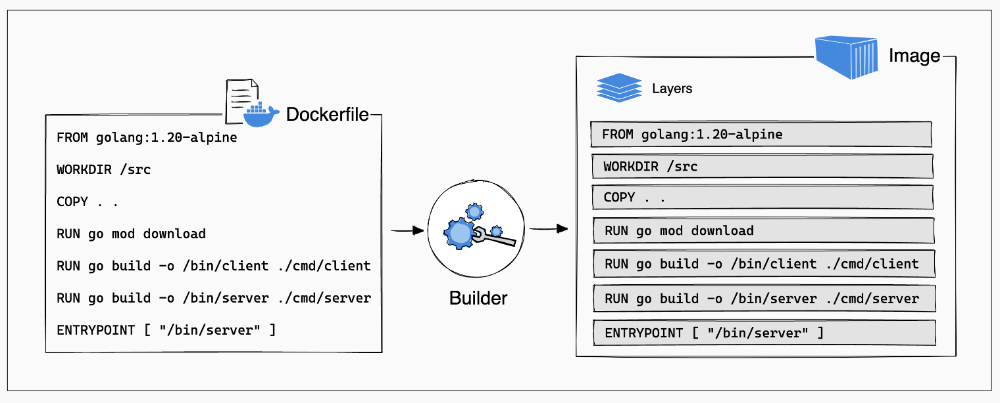
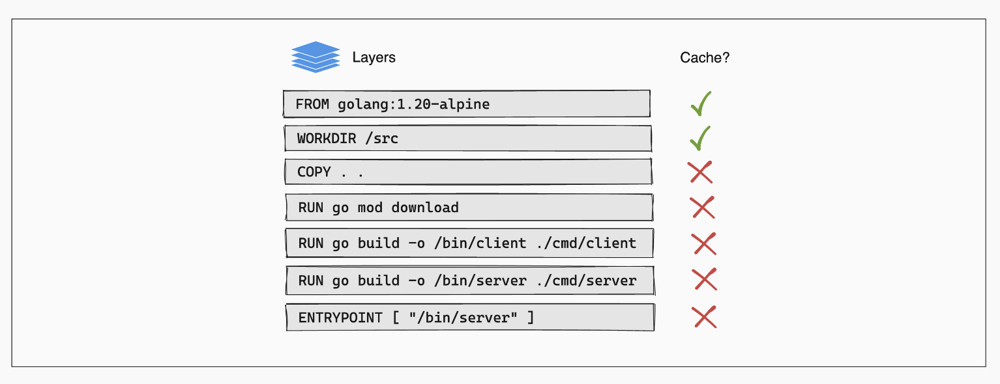
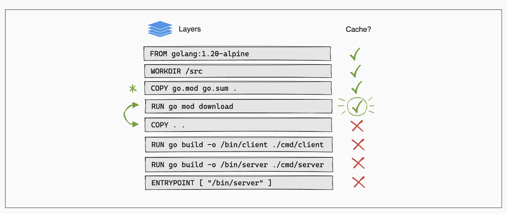

# Dockerfile layer

도커는 이미지를 만들 때 여러 개의 계층(layer)을 가진 다수의 스냅샷으로 나누어 저장한다.
이는 여러 이미지 파일들을 관리할 때 중복되는 영역을 하나의 레이어를 통해 관리하여 공간/시간적 효율을
얻는 장점이 있다.

즉, 도커는 Dockerfile을 읽어들여, **파일 시스템에 변화를 주는 커맨드마다 새로운 이미지 레이어**를
만든다. 이것으로 중복되는 레이어를 다시 다운로드 받을 필요가 없어져 이미지의 다운로드 시간을 절약한다.



## 특정 이미지에 대한 inspect 로 layer 확인하기

```shell
docker image inspect node-local:1.0
```

결과는 아래와 같으며, RootFS를 확인하여 해당 이미지가 9개의 레이어로 구성되어있음을 볼 수 있다.

```shell
[
    {
        "Id": "sha256:d2b1b719a1f60fbe9cb436a112117d517423bab19764c55cc0e61258fd1d7f31",
        "RepoTags": [
            "node-local:0.1"
        ],
        ...
        "RootFS": {
            "Type": "layers",
            "Layers": [
                "sha256:b09314aec293bcd9a8ee5e643539437b3846f9e5e55f79e282e5f67e3026de5e",
                "sha256:41becf86c7a23a890f2b72907619a62f1cec8523cfd6cd888b991d9c2459b5af",
                "sha256:4a376e76c5414adb4255663cd8d7c4f6c27df8036a6559a4e155889c0fddfdc1",
                "sha256:a636c9c56d21c54aadde0308b86a504b93598ce159c2800dc7bff428f037540e",
                "sha256:da23e30e92e9b53cdd2ab7b0a6e4891c2ad3f35c9ebb2c9289e4574afdabb225",
                "sha256:32605136cc29f06e42d37cd31ddd7bc8c7c8c9543fdf6045cbf765f7d0addd38",
                "sha256:6fc3c304e8f9abd83e399c8af09b9154e1a4a0b7a50fd34881c2fd9f29e7ad99",
                "sha256:7fd12f2647fc8c298469ca22bae9615e3094bc6859df9e4eb72b64b912804297",
                "sha256:7d603fc35fe21540db1112f38d891984fe6617bab14ab93f51549abe5e38ecb4"
            ]
        },
        "Metadata": {
            "LastTagTime": "2024-05-16T01:03:16.298319883Z"
        }
    }
]
```

## Layer 를 생성하고 생성하지 않는 syntax

- RUN, COPY, ADD, WORKDIR, USER
- ENV, LABEL, ARG, EXPOSE

RUN: 새로운 레이어를 생성하고 그 안에서 명령을 실행

- 따라서 &&로 여러개의 명령어를 이어서 하나의 레이어가 생성되도록 한다.
- 예시: RUN apt-get update && apt-get install -y python

COPY: 새로운 파일 또는 디렉토리를 추가하고 새로운 레이어를 생성한다.

ADD: COPY와 유사하게 새로운 파일 또늗 디렉토리를 추가하고 레이어를 생성한다.

USER: 새로운 사용자를 설정하고 레이어를 생성한다. 해당 사용자의 UID와 GID가 새로운 레이어에 반영.

> 만약 Dockerfile의 RUN, ADD, COPY, WORKDIR 과 같은 명령문이 수정되면, 기존 캐시가 무효화
> 되고, 새로운 레이어를 생성한다.

## Cached layers 와 Dockerfile 명령어 순서

- 이미지 빌드를 실행하면 이전 빌드의 레이어를 재사용하려고 시도한다.
- 이미지의 레이어가 변경되지 않은 경우, 빌더는 빌드 캐시에서 레이어를 가져온다.
- 마지막 빌드 이후 레이어가 변경된 경우 해당 레이어와 그 뒤에 있는 모든 레이어를 다시 빌드한다.



위의 이미지에서 보듯이 Dockerfile은 모든 프로젝트 파일을 컨테이너에 복사(COPY . .) 한 다음,
다음 단계에서 애플리케이션 종속성을 다운로드(RUN go mod download) 한다.

- 프로젝트의 파일을 변경하면, COPY 레이어에 대한 캐시가 무효화 된다.
- 또한, 그 뒤에 오는 모든 레이어에 대한 캐시도 무효화된다.

여기서 도커파일 지침의 순서 때문에 빌더는 패키지가 변경되지 않았음에도 Go 모듈을 다시 다운로드해야 한다.

Dockerfile 지침 순서를 변경하여 이러한 중복을 방지할 수 있다.

소스 코드가 컨테이너에 복사되기 전에 종속성 다운로드 및 설치가 이루어지도록 순서를 변경한다. 이렇게 하면,
소스 코드를 변경할 때에도 빌더가 캐시에서 종속성 레이어를 재사용할 수 있다.

Go의 경우 go.mod 와 go.sum이라는 두 개의 파일을 사용하는데, 이는 node의 package.json 과
package-lock.json 과 같다.

순서를 아래와 같이 변경한다.

- COPY go.mod go.sum . 를 먼저 배치하고 RUN을 통해 종속성을 설치한다.
- 그 후에 COPY . . 명령어로 소스 코드를 복사한다.

```Dockerfile
FROM golang:1.21-alpine

WORKDIR /src

COPY go.mod go.sum .

RUN go mod download

COPY . .

RUN go build -o /bin/client ./cmd/client
RUN go build -o /bin/server ./cmd/server

ENTRYPOINT [ "/bin/server" ]
```

이제 소스 코드를 편집하면 이미지를 빌드할 때 빌더가 매번 종속성을 다운로드하지 않는다.



### 참고 문서

- [Layers](https://docs.docker.com/build/guide/layers/#update-the-instruction-order)
- [Docker build cache](https://docs.docker.com/build/cache/)
- [Dockerfile best practices](https://docs.docker.com/develop/develop-images/dockerfile_best-practices/)
- [Best practices to containerize Node.js web applications with Docker](https://snyk.io/blog/10-best-practices-to-containerize-nodejs-web-applications-with-docker/)
